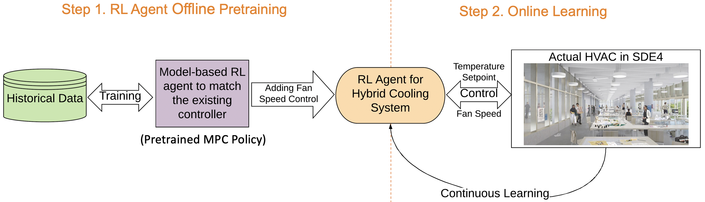

An NUS-Kajima project funded by [Kajima Singapore](https://www.kajima.com.sg/).

SDE4 building at NUS is Singapore’s first net zero energy and WELL gold
certified building. For the NUS-Kajima collaboration project, we would like to
take it to the next level by implementing advanced machine learning based
control for the HVAC systems.

Reinforcement learning has been successful in applications as diverse as
autonomous helicopter flight, robot legged locomotion, playing video games,
marketing strategy selection, etc. It also has the ability to keep perfecting
its algorithm during online deployment. With such a powerful tool, we are
exploring a practical approach to integrate it into the real world building. By
optimal control of the room temperature setpoint and ceiling fan speed at the
same time, we can not only achieve a more energy efficient operation, but also
maximize the occupants’ thermal comfort.

The objectives of this study are to:

1. Develop a multi-objective reinforcement learning control with short-term
   historical data for the hybrid cooling system in SDE4 building to minimize
   the energy consumption while maximize the thermal comfort.
2. Demonstrate the real-world control performance in an open office or a studio
   room at SDE4.

