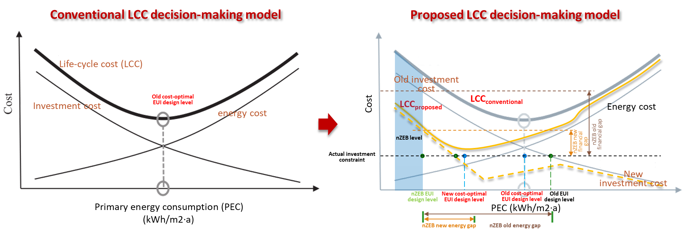

Life-cycle cost analyses (LCCA) is usually coupled with whole building energy
optimization to generate the cost-optimal design with good energy efficiency.
Comparing with the isolated building system optimization, a combination of
passive and active strategies is generally recognized that can result in a lower
life-cycle cost (LCC) with better energy performance in the literature. With the
passive design parameters being optimized, the heating and cooling load of the
building could be decreased, leading to a reduction in the size of the HVAC
system. for integrated building design. However, in the current cost-optimal
decision-making framework, there is no difference in the costing process whether
it is performed on the integrated building system or the single system energy
optimization. Although the dynamic energy simulation can well demonstrate the
energy benefit gained from the integrated design, the cost-benefit usually be
highly underestimated due to the little considering of the effect that load
reductions have on the capital and running costs of the HVAC system.

Against this background, this research proposes a holistic LCC optimization
approach for the integrated building design, which concerns the cost integration
between passive design and HVAC costs and the tradeoff between initial
investment for ECMs and long-term benefits. Three LCC optimization methods are
performed for the case study and their impact on Pareto front solutions’ energy
and cost performance is compared in this study. This research can contribute to
a better understanding and interpretation of the cost-effectiveness in energy
conservation, which is the basis for successful design decisions and policy
implementation.

To improve energy efficiency, evaluating the energy savings potential of energy
conservation measures (ECMs) is a critical task. During new buildings design or
building retrofits, occupancy and plug-loads schedules can significantly impact
building energy use and is a leading factor in uncertainty when determining the
effectiveness of ECMs and operation strategies. Current simulation-based
assessment methods simplify the occupancy related schedules by using a standard
or representative set of static and homogeneous assumptions. The simplification
contributes to significant gaps between the simulated and measured actual energy
performance of buildings.

This study presents a framework for identifying and quantifying the impact of
occupancy-related schedules on ECMs’ performance using building energy
simulation. An institutional building located in Singapore is used for a case
study. Two spatial resolution and five temporal resolution are combined to
establish different base models for energy simulation, representing different
accuracy levels of occupancy-related schedules. Then, a simulation workflow is
performed for each ECM to determine its energy savings under different levels of
input schedules. Finally, the ECM decision is determined based on the simulated
energy performance and compared among different base models. This research can
contribute to our understanding of the interactions between model complexity and
energy efficiency design, facilitating future discussions on the right level of
abstraction when modeling occupancy in building performance simulation.

