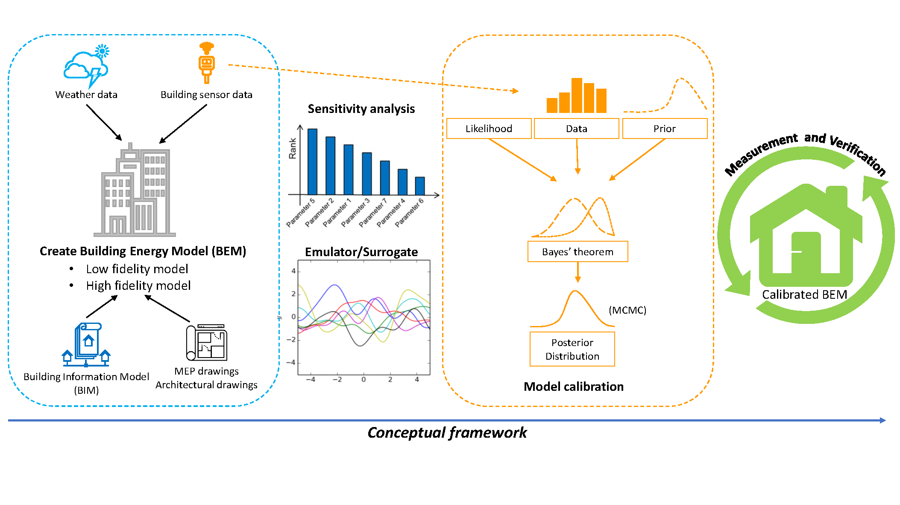

An NUS project in collaboration with [Professor Godfried L. Augenbroe (Georgia
Institute of Technology)](https://arch.gatech.edu/people/godfried-l-augenbroe),
funded by NUS Start-up Grant.

In 2009, the Building and Construction Authority (BCA) in Singapore set an
ambitious plan to have at least 80% of the buildings in Singapore be Green Mark
certified by 2030. With measures in place to meet this 80% target, the number
of Green Mark certified buildings has grown significantly from 17 during the
launch of the BCA Green Mark scheme in 2005 to more than 2100 in 2014. With the
exponential increase in the number of Green Mark certified buildings, there is
an urgent need for the verification of their actual performance. The need to
"validate performance, raise and build awareness and capability" has also been
identified as one of the key initiatives of the S\$52 Million Green Buildings
Innovation Cluster (GBIC) Fund allocated by the Singapore National Research
Foundation (NRF), in the most recent third green building masterplan released
by BCA. Currently, the best practices for M&V are documented in several
guidelines, including the International Performance Measurement and
Verification Protocol (IPMVP), ASHRAE Guideline 14 and M&V Guidelines prepared
for the U.S. Department of Energy (DOE) Federal Energy Management Program
(FEMP). Most of these efforts are driven by the need to use a BEM to predict
the savings of different Energy Conservation Measures (ECM). The benefits of
having validated BEMs of the building stock go however beyond this, as is
becoming clear in recent resilient community and energy microgrid studies etc.
This research targets the M&V protocols to arrive at validated BEM's for this
multitude of future uses.

The finds from this research could facilitate the creation of a web-platform
for data sharing, automated sensor to BEM mapping, automated calibration,
guided M&V and advanced retrofit analysis to support the concept of life-cycle
building energy modelling (BEM).

The objectives of this research project are:
1. Produce a framework for M&V laying guidelines with regards to data
   resolution and model fidelity.
2. Be one of the few that addresses the important problem of
   non-identifiability that is typically neglected in BEM calibration studies.
3. Provide insights into how the level of resolution of sensor data might
   influence the level of confidence in the model.
4. Demonstrate the advantages and disadvantages of using a low fidelity model
   for calibration and how it compares with a high-fidelity model.
5. Come up with a cost-benefit analysis of different methods to generate
   certified building energy models.

The outcomes will be crucially important for scaling up to the Singapore building stock.

