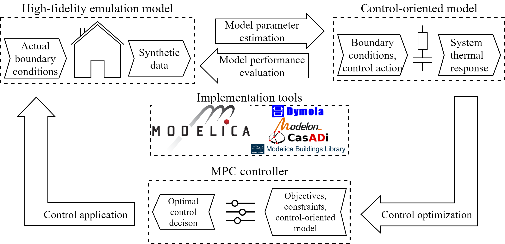

Model predictive control (MPC) has shown great potential in improving the
building operation performance and saving energy. However, its actual
implementation is restricted by the high configuration cost. Control-oriented
model is the cornerstone of MPC and the most challenging part. Due to the
paucity of a systematic understanding, it is also hard to estimate the efforts
required to obtain the model. Therefore, this study aims at improving the
scalability of MPC by addressing modeling-related issues and establishing an
automated framework.

While many past studies demonstrated the usefulness of MPC through simulation
and experiments, more attention is required for quantifiable relationships
between data requirement, model performance, and control performance. The data
used to obtain the model and implement control is essential for the ultimate
performance. However, data availability and quality vary among different
buildings. Therefore, an important question for scalability is what data is
necessary and/or desired. On the other hand, it is unclear how the predictive
capability of control-oriented models affects the control performance. The
answer to this question involves a model performance evaluation approach, which
tests not just the predictive accuracy, and series of experiments to quantify
the relationships.

Virtual testbeds with single and multi-zone emulators are implemented to
address the questions. Different data availability conditions are designed to
obtain alternative control-oriented models. All alternatives are
comprehensively evaluated in terms of prediction and control performance.
Thereby, quantitative relationships between data requirement, model
performance, and control performance are established. The virtual experiments
are partially duplicated in an actual testbed for verification. Subsequently,
a MPC framework is proposed to automatically configure and evaluate the models
based on data availabilities and control purposes. The framework is showcased
in actual buildings.

